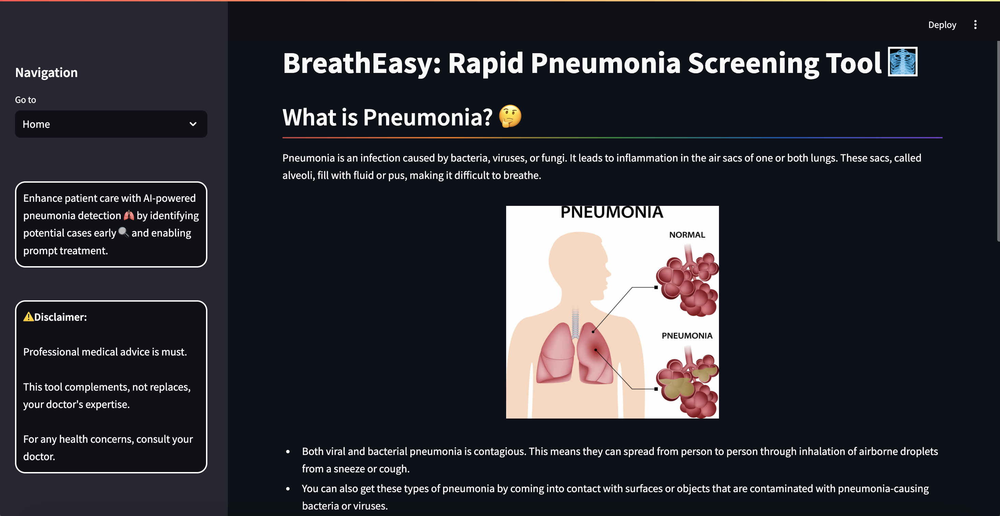
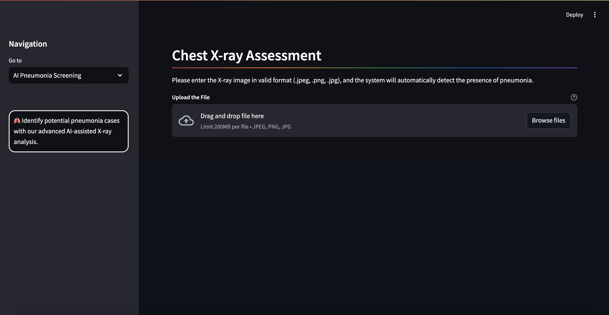
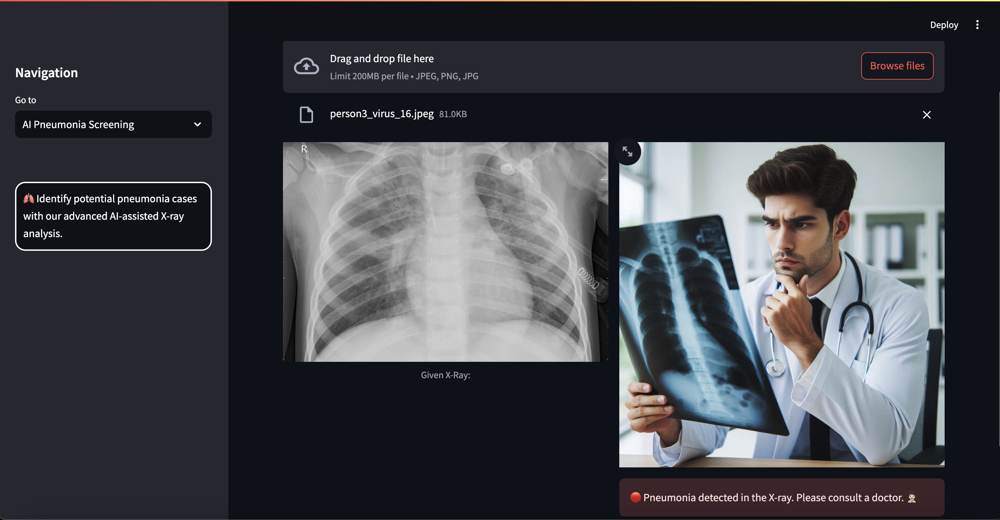
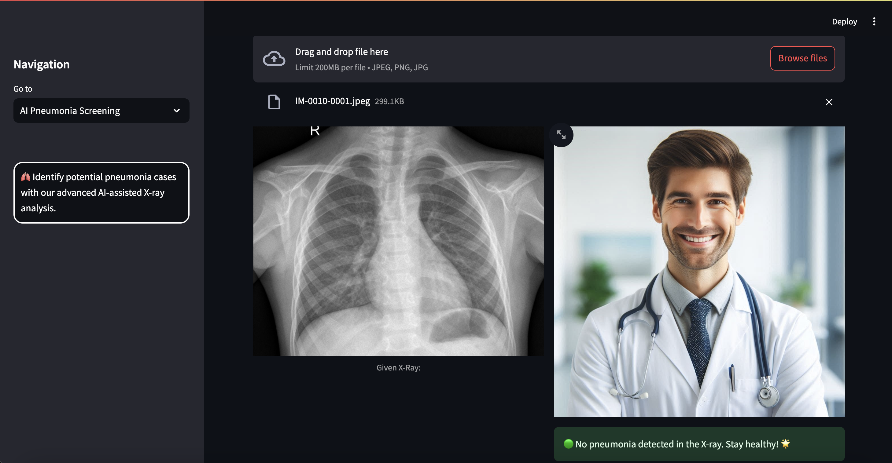
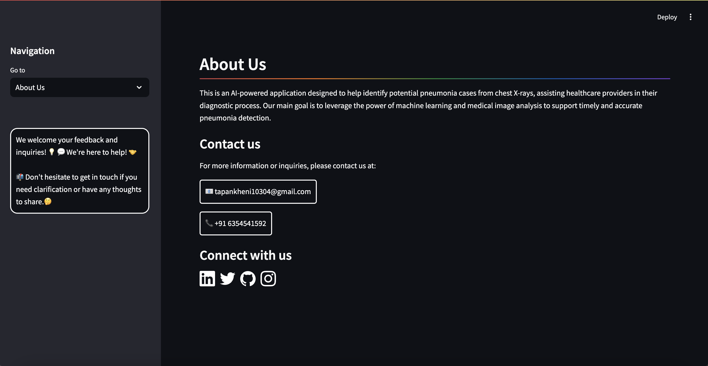

## BreathEasy: Rapid Pneumonia Screening Tool 🩻

Pneumonia is an infection that inflames the air sacs in one or both lungs. The air sacs may fill with fluid or pus (purulent material), causing cough with phlegm or pus, fever, chills, and difficulty breathing. A variety of organisms, including bacteria, viruses and fungi, can cause pneumonia.

Pneumonia can range in seriousness from mild to life-threatening. It is most serious for infants and young children, people older than age 65, and people with health problems or weakened immune systems.

<details open="open">
  <summary>Table of Contents</summary>
  <ol>
    <li>
      <a href="#Approach">Approach</a>
    </li>
    <li>
      <a href="#Features">Features</a>
    </li>
    <li>
      <a href="#Technologies">Technologies</a>
    </li>
    <li>
      <a href="#Prototype">Protoype</a>
    </li>
    <li>
	    <a href = "#How-to-Start-Project">How to Start Project</a>
    </li>
    <li>
	    <a href = "#Contact-Us">Contact Us</a>
    </li>
    <li>
	    <a href = "#License">License</a>
    </li>
    <li>
	    <a href = "#Note">Special Note</a>
    </li>
  </ol>
</details>

## Approach
The CNN is trained on a large dataset of chest X-rays, enabling it to:
- Identify potential pneumonia cases from medical imaging.

## Features
This AI-enabled solution has the potential to:
- Reduce the time needed for pneumonia diagnosis.
- Improve the accuracy of pneumonia detection.
- Enhance the overall quality of patient care in respiratory medicine.

## Technologies
- Python
- Streamlit
- PyTorch

## Prototype:
<div style="display:flex; flex-wrap:wrap; gap:2%; justify-content:center;">





</div>

## How to Start Project
Follow these steps to get started with the project:

1. **Clone the Repository:**
   ```bash
   git clone <repository_link>
   ```
2. **Install Anaconda:**
   
   Make sure you have Anaconda installed on your system. If not, you can download and install it from the official website: https://www.anaconda.com/download/
   
4. **Create a Virtual Environment:**
   
   Create a new virtual environment using Python 3.9.6:

   ```bash
   conda create --name your_env_name python=3.9.6 -y
   ```
   Replace your_env_name with the desired name for your virtual environment.
   
   Activate the newly created environment:
   ```bash
   conda activate your_env_name
   ```
5. **Install Dependencies:**
   
   Install the project dependencies by running:
   ```bash
   pip install -r requirements.txt
   ```
   This command will install all the required packages listed in the requirements.txt file.

7. **Run the Streamlit App:**
   ```bash
   streamlit run app.py
   ```
   This command will start the Streamlit app.

## Contact Us
To learn more about our system and how it can help to reduce cost, please reach out:

📧 tapankheni10304@gmail.com

## License
This project is licensed under the MIT License - see the [LICENSE](LICENSE) file for details.

## Note:
You might face certain issues related to numpy version because torchvision uses numpy behind the scene to deal with the image data and sometimes it causes version compatibility issues.
Ever get stuck, just run the following command:
```bash
   pip install --upgrade numpy torchvision
```

